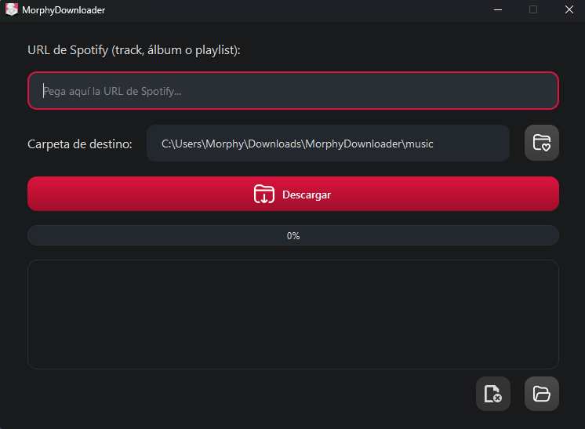
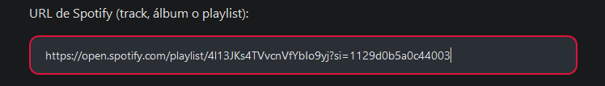

# MorphyDownloader 🎵

**Una herramienta moderna y de código abierto para descargar canciones, álbumes o playlists de Spotify** en archivos MP3, obteniendo el audio desde YouTube y añadiendo automáticamente metadatos completos (título, artista, álbum, carátula, año, etc.). Incluye tanto una interfaz gráfica intuitiva (GUI) como una potente línea de comandos (CLI).



---

---

## 🚀 ¿Cómo funciona?

1. Obtiene la información de la canción, álbum o playlist desde Spotify usando la API oficial (necesitas tus propias credenciales).
2. Busca la mejor coincidencia en YouTube para cada pista usando yt-dlp.
3. Descarga el audio en la mejor calidad disponible y lo convierte a MP3 usando ffmpeg.
4. Añade metadatos completos y carátula desde Spotify usando mutagen.
5. El proceso es totalmente automático, robusto y muestra el progreso claramente tanto en CLI como en GUI.



**Nota:**

- El programa NO contiene malware, spyware ni troyanos. Todo el código es abierto y auditable.
- Se recomienda desactivar temporalmente el Antivirus si el navegador no permite descargarlo.
- Necesitas tus propias credenciales de la API de Spotify (ver abajo). La app te guiará en la configuración la primera vez que la ejecutes.

---

---

## 🛠️ Instalación y requisitos

1. **Python 3.12 o superior** 🐍
2. **ffmpeg** instalado y en tu PATH ([descargar aquí](https://www.gyan.dev/ffmpeg/builds/))
3. Instala las dependencias:

   ```sh
   pip install -r requirements.txt
   ```

4. Crea una app en el [Spotify Developer Dashboard](https://developer.spotify.com/dashboard/) y obtén tu `Client ID` y `Client Secret`.

5. Configura tus credenciales:

   - El programa te guiará en la configuración la primera vez que lo ejecutes (recomendado para la mayoría de usuarios).
   - Alternativamente, puedes establecer las siguientes variables de entorno manualmente:
     - `SPOTIPY_CLIENT_ID`
     - `SPOTIPY_CLIENT_SECRET`

---

## 📥 Descargar (Ejecutable precompilado)

Puedes descargar un `.exe` precompilado (y versión consola) desde la sección de releases de GitHub. No requiere instalación: solo ejecuta el archivo y sigue las instrucciones de configuración.


---

---

## 🎧 Uso

### Interfaz gráfica (GUI)

Para lanzar la GUI:

```sh
python main.py
```

Pega tu URL de Spotify, elige la carpeta de destino y sigue el progreso en tiempo real.

### Línea de comandos (CLI)

Ejemplo para descargar una playlist:

```sh
python -m morphydownloader.cli --url "https://open.spotify.com/playlist/ID_DE_LA_PLAYLIST" --output music
```

Opciones principales:

- `--url`: URL de playlist, álbum o canción de Spotify
- `--output`: Carpeta de destino para los MP3

---

---

## 📂 Estructura del proyecto

- `main.py`: Punto de entrada. Lanza la GUI por defecto o la CLI si se indica.
- `morphydownloader/`: Código fuente principal.
  - `cli.py`: Lógica de la CLI.
  - `gui/qt_gui.py`: Interfaz gráfica Qt.
  - `core/`: Módulos de integración con Spotify, YouTube y metadatos.
  - `config.py`, `utils.py`: Utilidades y configuración.
- `assets/`: Iconos y recursos gráficos.
- `requirements.txt`: Dependencias Python.

---

---

## 📦 Dependencias principales

- yt-dlp (descarga y búsqueda en YouTube)
- spotipy (API de Spotify)
- mutagen (metadatos MP3)
- PySide6 (GUI Qt)
- typer (CLI)
- rich (salida colorida)
- ffmpeg (debes instalarlo manualmente)

---

---

## ⚠️ Notas y recomendaciones

- El proyecto es modular y fácil de mantener o extender.
- Si tienes problemas con la búsqueda en YouTube, asegúrate de tener la última versión de yt-dlp y ffmpeg.
- Los archivos temporales y tokens se regeneran automáticamente.
- ¡Si te gusta este proyecto, considera darle una ⭐ en GitHub y compartirlo!

---

---

## 📜 Licencia

MIT License

---

**¡Gracias por usar MorphyDownloader!** 🎧 Si tienes sugerencias, abre un issue o pull request.

---

# English

For the English version, see [README.md](README.md)
