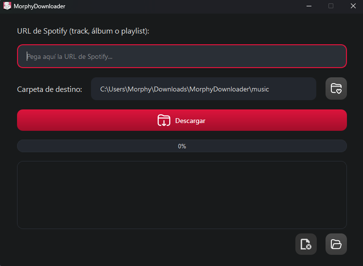
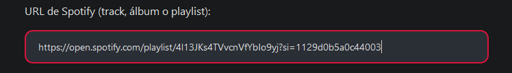

# Harmony

Harmony es una aplicación de escritorio y línea de comandos para descargar música desde enlaces de Spotify y YouTube. Puede procesar canciones, álbumes y playlists de Spotify, buscar el audio correspondiente en YouTube, descargarlo como M4A o MP3 y escribir metadatos como título, artista, álbum, número de pista, fecha de lanzamiento, carátula y letras opcionales. También permite descargar directamente videos y playlists de YouTube.



## Funciones

- Descarga desde canciones, álbumes y playlists de Spotify.
- Descarga directa desde videos y playlists de YouTube.
- Guarda audio como M4A sin conversión, o como MP3 cuando FFmpeg está disponible.
- Añade metadatos y carátula con `mutagen`.
- Plantillas opcionales para nombres de archivo y subcarpetas para álbumes/playlists.
- Descargas paralelas configurables.
- Interfaz gráfica con PySide6 y CLI con Typer/Rich.
- Las credenciales de Spotify solo son necesarias para enlaces de Spotify. Los enlaces de YouTube funcionan sin configurar Spotify.

## Cómo Funciona

Harmony tiene dos flujos de descarga:

1. **URL de Spotify**
   - Lee metadatos de canción, álbum o playlist mediante la Spotify Web API.
   - Construye búsquedas optimizadas de YouTube para cada pista.
   - Selecciona la mejor coincidencia usando título, artista, canal y duración.
   - Descarga el audio con `yt-dlp`.
   - Aplica metadatos y carátula de Spotify.

2. **URL de YouTube**
   - Detecta si la URL apunta a un video o una playlist.
   - Lee la metadata disponible directamente con `yt-dlp`.
   - Descarga cada video como audio.
   - Aplica metadatos derivados de YouTube y miniatura cuando está disponible.



## URLs Compatibles

- `https://open.spotify.com/track/...`
- `https://open.spotify.com/album/...`
- `https://open.spotify.com/playlist/...`
- `https://youtu.be/...`
- `https://www.youtube.com/watch?v=...`
- `https://www.youtube.com/playlist?list=...`
- Enlaces de YouTube Music compatibles con `yt-dlp`

Si una URL de video de YouTube también contiene el parámetro `list=`, Harmony la trata como una playlist.

## Requisitos

- Python 3.12 o superior
- Credenciales de Spotify Developer para descargas desde Spotify
- FFmpeg solo si quieres salida en MP3

Instala las dependencias de Python:

```sh
pip install -r requirements.txt
```

Dependencias principales:

- `yt-dlp`
- `spotipy`
- `mutagen`
- `PySide6`
- `typer`
- `rich`
- `certifi`

## Ejecutable Precompilado

Las builds de Windows se pueden publicar en GitHub Releases como archivo ZIP. Los usuarios solo necesitan extraer el ZIP y ejecutar `Harmony.exe`; la versión empaquetada no requiere instalar Python.


## Configuración de Spotify

Las credenciales de Spotify no son necesarias para descargar desde YouTube, pero sí para canciones, álbumes y playlists de Spotify.

1. Abre el [Spotify Developer Dashboard](https://developer.spotify.com/dashboard/).
2. Crea una aplicación.
3. Copia el `Client ID` y el `Client Secret`.
4. Agrégalos en la ventana de configuración de Harmony, o configúralos manualmente:

```sh
set SPOTIPY_CLIENT_ID=tu_client_id
set SPOTIPY_CLIENT_SECRET=tu_client_secret
```

PowerShell:

```powershell
$env:SPOTIPY_CLIENT_ID="tu_client_id"
$env:SPOTIPY_CLIENT_SECRET="tu_client_secret"
```

## Uso

### Interfaz Gráfica

Inicia la aplicación:

```sh
python main.py
```

Pega una URL de Spotify o YouTube, elige la carpeta de destino, selecciona el formato de audio e inicia la descarga. Desde el botón de configuración puedes cambiar formato, calidad, plantilla de nombres, subcarpetas, tema, idioma, letras y descargas paralelas.

### Línea de Comandos

Ejemplo con playlist de Spotify:

```sh
python -m m4a_downloader.cli --url "https://open.spotify.com/playlist/ID_DE_PLAYLIST" --output music
```

Ejemplo con video de YouTube:

```sh
python -m m4a_downloader.cli --url "https://www.youtube.com/watch?v=ID_DEL_VIDEO" --output music
```

Ejemplo con playlist de YouTube:

```sh
python -m m4a_downloader.cli --url "https://www.youtube.com/playlist?list=ID_DE_PLAYLIST" --output music
```

Opciones útiles:

- `--url`, `-u`: URL de Spotify o YouTube.
- `--output`: Carpeta de salida. Por defecto usa `music`.
- `--format`, `-f`: `m4a` o `mp3`.
- `--quality`, `-q`: Bitrate para MP3, por ejemplo `128`, `192`, `256` o `320`.
- `--parallel`, `-p`: Número de descargas paralelas, de `1` a `8`.

## Crear la Build de Windows

La build principal de la interfaz usa `Harmony.spec`.

```powershell
pyinstaller --clean --noconfirm Harmony.spec
```

El resultado se genera en:

```text
dist/Harmony/
```

Para crear un ZIP listo para subir a GitHub Releases:

```powershell
Compress-Archive -Path .\dist\Harmony\* -DestinationPath .\dist\Harmony-windows.zip -Force
```

## Estructura del Proyecto

```text
.
├── main.py
├── m4a_downloader/
│   ├── cli.py
│   ├── config.py
│   ├── locales.py
│   ├── utils.py
│   ├── core/
│   │   ├── metadata.py
│   │   ├── spotify_client.py
│   │   └── youtube_downloader.py
│   └── gui/
│       ├── config_dialog.py
│       ├── qt_gui.py
│       └── theme_manager.py
├── assets/
├── docs/
├── Harmony.spec
├── m4a_downloader.spec
└── requirements.txt
```

## Notas

- M4A es el formato predeterminado porque se puede descargar directamente desde YouTube sin conversión.
- La salida MP3 requiere FFmpeg. Si FFmpeg no está disponible, Harmony usa M4A como alternativa.
- La extracción desde YouTube depende de `yt-dlp`; mantenerlo actualizado ayuda cuando YouTube cambia su comportamiento.
- Descarga solo contenido propio, de dominio público o contenido para el que tengas permiso.

## Licencia

Licencia MIT.

## English

For the English version, see [README.md](README.md).
